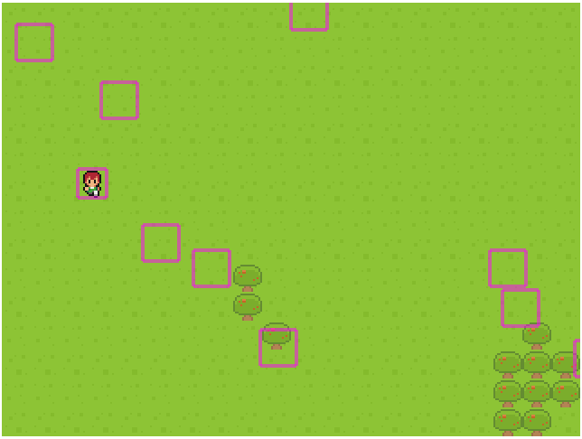

# phaser-rpg
Typescript implementation of phaser 3 RPG tutorial here: https://gamedevacademy.org/how-to-create-a-turn-based-rpg-game-in-phaser-3-part-1/

This uses:
* Typescript 3.8
* ESLint
* Parcel
* Gihub Actions w/ Deploy to Gihub Pages

To start w/ watch + dev server: `npm run start`

# Example Site

http://tarwn.github.io/phaser-rpg

